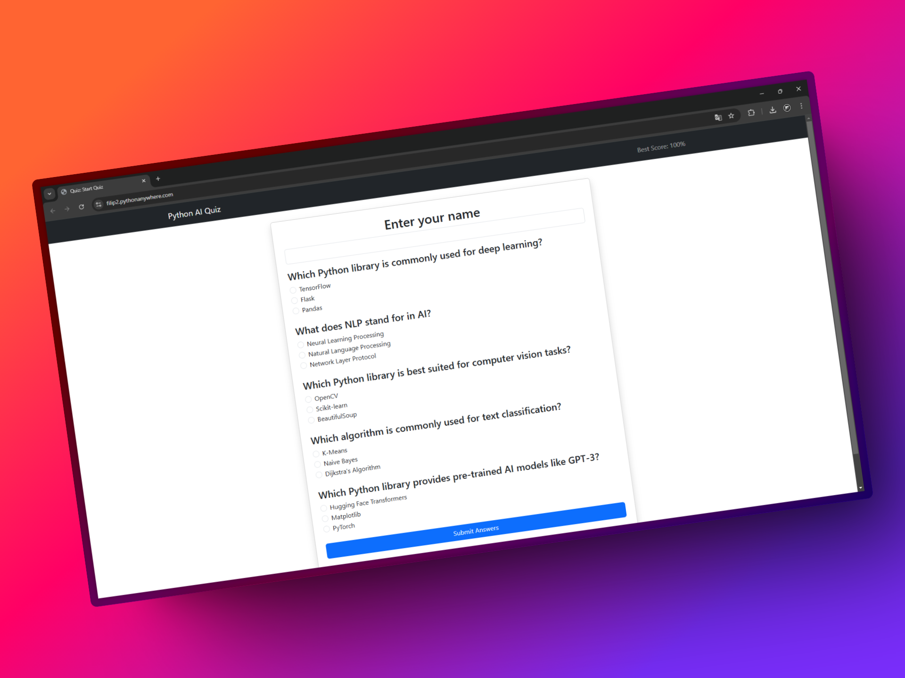

# 🧠 Python AI Quiz

<div align="center">
    
</div>

---

This is a web-based **Python AI Quiz Application** built using **Flask, SQLAlchemy, and Bootstrap**. The quiz focuses on **Artificial Intelligence (AI) topics** such as **deep learning, computer vision, and natural language processing (NLP)**.

## 🚀 Features
✅ AI-related quiz with multiple-choice questions  
✅ User session management (tracks the highest score)  
✅ Dynamic leaderboard displaying the best score  
✅ Responsive design using Bootstrap  
✅ Modular and structured Flask application  
✅ SQLite database integration  

## 💻 Technologies Used
- **Python** (Flask, SQLAlchemy, Flask-Session)
- **HTML, CSS, Bootstrap** (Frontend)
- **SQLite** (Database)
- **Docker** (Environment)

## 📜 Installation Guide (with Docker)

### **1️⃣ Clone the Repository**
```sh
git clone https://github.com/FilipRokita/python-ai-quiz
cd python-ai-quiz
```

### **2️⃣ Run Docker Compose**
```sh
docker compose up -d
```

✅ **Visit:** `http://0.0.0.0:8082/`

## 📜 Installation Guide (without Docker)

### **1️⃣ Clone the Repository**
```sh
git clone https://github.com/FilipRokita/python-ai-quiz
cd python-ai-quiz
```

### **2️⃣ Install Dependencies**
```sh
pip install -r requirements.txt
```

### **3️⃣ Initialize the Database**
```sh
python init_db.py
```

### **4️⃣ Add Python AI Quiz Questions**
```sh
python add_questions.py
```

### **5️⃣ Run the Flask App**
```sh
python app.py
```
✅ **Visit:** `http://127.0.0.1:5000/`

---

## 📌 Author
**👨‍💻 Filip Rokita**    
🔗 [LinkedIn Profile](https://www.linkedin.com/in/filiprokita/)  
🔗 [GitHub Profile](https://github.com/FilipRokita)

---

## 📜 License
This project is licensed under the **[MIT License](LICENSE)**.

---

### **🌟 If you like this project, please give it a ⭐ on GitHub!**  
🚀 **Happy coding!** 😊
